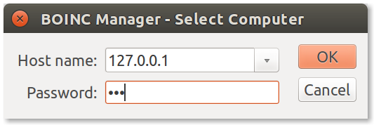

# BOINC client in a Docker container

[](https://microbadger.com/images/boinc/client "Get your own version badge on microbadger.com")
[](https://microbadger.com/images/boinc/client "Get your own image badge on microbadger.com")


The client can be accessed remotely or locally with any BOINC Manager.

**Contents**
- [News](#news)
- [Usage](#usage)
- [Other versions](#other-versions)
- [Swarm mode](#swarm-mode)
- [Parameters](#parameters)
- [Docker Compose](#docker-compose)
- [More Info](#more-info)

## News

* **Dec 3 2018:** _Breaking change!_ From version 7.10.2 [on Linux the default working directory changed to](https://boinc.berkeley.edu/wiki/Release_Notes_for_BOINC_7.10) `/var/lib/boinc` from `/var/lib/boinc-client`. We changed our images accordingly. The new images must be run with the new commands, or it won't recognize the previous data and settings.

## Usage

The following command runs the BOINC client Docker container,

```
docker run -d \
  --name boinc \
  --net=host \
  -v /opt/appdata/boinc:/var/lib/boinc \
  -e BOINC_GUI_RPC_PASSWORD="123" \
  -e BOINC_CMD_LINE_OPTIONS="--allow_remote_gui_rpc" \
  boinc/client
```

You can attach a BOINC Manager to the client by launching the BOINC Manager, going to `File > Select computer...`, and entering the IP address of the PC running the Docker container in the "Host name" field (`127.0.0.1` if running locally) as well as the password you set with `BOINC_GUI_RPC_PASSWORD` (here `123`),



As usual, the client can also be controlled from the command line via the `boinccmd` command. 

From the same computer as the one which is running the Docker container, you can issue commands via,

```
docker exec boinc boinccmd <args>
```

From other computers, you should use instead,

```
docker run --rm boinc/client boinccmd --host <host> --passwd 123 <args>
```

where `<host>` should be the hostname or IP address of the machine running the Docker container. 

You are also free to run `boinccmd` natively if you have it installed, rather than via Docker. 


## Other versions

You can replace `boinc/client` above with either of the following tags to use one of the specialized container versions instead.

- [`boinc/client:amd`](Dockerfile.amd) - AMD GPU-savvy BOINC client. Check the usage [below](#amd-gpu-savvy-boinc-client-usage).
- [`boinc/client:arm32v7`](Dockerfile.arm32v7) - ARMv7 32-bit savvy BOINC client. Check the usage [below](#armv7-32-bit-savvy-boinc-client-usage).
- [`boinc/client:intel`](Dockerfile.intel) - Intel GPU-savvy BOINC client. It supports Broadwell (5th generation) CPUs and beyond. Check the usage [below](#intel-gpu-savvy-boinc-client-usage).
- [`boinc/client:intel-legacy`](Dockerfile.intel-legacy) - Legacy Intel GPU-savvy BOINC client (Sandybridge - 2nd Gen, Ivybridge - 3rd Gen, Haswell - 4th Gen). Check the usage [below](#legacy-intel-gpu-savvy-boinc-client-usage).
- [`boinc/client:multi-gpu`](Dockerfile.multi-gpu) - Intel & Nvidia-savvy BOINC client. Check the usage [below](#multi-gpu-savvy-boinc-client-usage).
- [`boinc/client:nvidia`](Dockerfile.nvidia) - NVIDIA-savvy (CUDA & OpenCL) BOINC client. Check the usage [below](#nvidia-savvy-boinc-client-usage).
- [`boinc/client:virtualbox`](Dockerfile.virtualbox) - VirtualBox-savvy BOINC client. Check the usage [below](#virtualbox-savvy-boinc-client-usage).


### AMD GPU-savvy BOINC client usage
- Install the [ROCm Driver](https://rocm.github.io/ROCmInstall.html).
- Reboot your system.
- Run the following command.
```
docker run -d \
  --name boinc \
  --device /dev/dri:/dev/dri \
  --device /dev/kfd:/dev/kfd \
  --net=host \
  --group-add video \
  -v /opt/appdata/boinc:/var/lib/boinc \
  -e BOINC_GUI_RPC_PASSWORD="123" \
  -e BOINC_CMD_LINE_OPTIONS="--allow_remote_gui_rpc" \
  boinc/client:amd
```

### ARMv7 32-bit savvy BOINC client usage
- Make sure you have [Docker installed on your Raspberry Pi](https://www.raspberrypi.org/blog/docker-comes-to-raspberry-pi/) or you are using a [Docker friendly OS](https://blog.hypriot.com/).
- Run the following command.
```
docker run -d \
  --name boinc \
  --net=host \
  -v /opt/appdata/boinc:/var/lib/boinc \
  -e BOINC_GUI_RPC_PASSWORD="123" \
  -e BOINC_CMD_LINE_OPTIONS="--allow_remote_gui_rpc" \
  boinc/client:arm32v7
```

### Intel GPU-savvy BOINC client usage
- Install the Intel GPU Driver.
- Run the following command:
```
docker run -d \
  --name boinc \
  --device /dev/dri:/dev/dri \
  --net=host \
  -v /opt/appdata/boinc:/var/lib/boinc \
  -e BOINC_GUI_RPC_PASSWORD="123" \
  -e BOINC_CMD_LINE_OPTIONS="--allow_remote_gui_rpc" \
  boinc/client:intel
```

### Legacy Intel GPU-savvy BOINC client usage
- Install the Intel GPU Driver.
- Run the following command:
```
docker run -d \
  --name boinc \
  --device /dev/dri:/dev/dri \
  --net=host \
  -v /opt/appdata/boinc:/var/lib/boinc \
  -e BOINC_GUI_RPC_PASSWORD="123" \
  -e BOINC_CMD_LINE_OPTIONS="--allow_remote_gui_rpc" \
  boinc/client:intel-legacy
```

### Multi GPU-savvy BOINC client usage
- Make sure you have installed the [NVIDIA driver](https://github.com/NVIDIA/nvidia-docker/wiki/Frequently-Asked-Questions#how-do-i-install-the-nvidia-driver).
- Install the NVIDIA-Docker version 2.0 by following the instructions [here](https://github.com/NVIDIA/nvidia-docker/wiki/Installation-(version-2.0)).
- Run the following command:
```
docker run -d \
  --runtime=nvidia \
  --name boinc \
  --device /dev/dri:/dev/dri \
  --net=host \
  -v /opt/appdata/boinc:/var/lib/boinc \
  -e BOINC_GUI_RPC_PASSWORD="123" \
  -e BOINC_CMD_LINE_OPTIONS="--allow_remote_gui_rpc" \
  boinc/client:multi-gpu
```

### NVIDIA-savvy BOINC client usage
- Make sure you have installed the [NVIDIA driver](https://github.com/NVIDIA/nvidia-docker/wiki/Frequently-Asked-Questions#how-do-i-install-the-nvidia-driver).
- Install the NVIDIA-Docker version 2.0 by following the instructions [here](https://github.com/NVIDIA/nvidia-docker/wiki/Installation-(version-2.0)).
- Run the following command:
```
docker run -d \
  --runtime=nvidia \
  --name boinc \
  --net=host \
  -v /opt/appdata/boinc:/var/lib/boinc \
  -e BOINC_GUI_RPC_PASSWORD="123" \
  -e BOINC_CMD_LINE_OPTIONS="--allow_remote_gui_rpc" \
  boinc/client:nvidia
```

### VirtualBox-savvy BOINC client usage

- Install the `virtualbox-dkms` package on the host.
- Run the following command:
```
docker run -d \
  --name boinc \
  --device=/dev/vboxdrv:/dev/vboxdrv \
  --net=host \
  -v /opt/appdata/boinc:/var/lib/boinc \
  -e BOINC_GUI_RPC_PASSWORD="123" \
  -e BOINC_CMD_LINE_OPTIONS="--allow_remote_gui_rpc" \
  boinc/client:virtualbox
```

## Swarm mode

You can use a Docker Swarm to launch a large number of clients, for example across a cluster that you are using for BOINC computation. First, start the swarm and create a network,

```
docker swarm init
docker network create -d overlay --attachable boinc
```

If you want, you can connect other nodes to your swarm by running the appropriate `docker swarm join` command on worker nodes as prompted above (although you can just run on one node too).

Then launch your clients,
```
docker service create \
  --replicas <N> \
  --name boinc \
  --network=boinc \
  -p 31416 \
  -e BOINC_GUI_RPC_PASSWORD="123" \
  -e BOINC_CMD_LINE_OPTIONS="--allow_remote_gui_rpc" \
  boinc/client
```

You now have `<N>` clients running, distributed across your swarm. You can issue commands to all of your clients via, 

```
docker run --rm --network boinc boinc/client boinccmd_swarm --passwd 123 <args>
```

Note you do not need to specify `--host`. The `boinccmd_swarm` command takes care of sending the command to each of the hosts in your swarm. 


## Parameters

When running the client, the following parameters are available (split into two halves, separated by a colon, the left hand side representing the host and the right the container side),

- `-v /opt/appdata/boinc:/var/lib/boinc` The path where you wish BOINC to store its configuration data.
- `-e BOINC_GUI_RPC_PASSWORD="123"` The password what you need to use, when you connect to the BOINC client. 
- `-e BOINC_CMD_LINE_OPTIONS="--allow_remote_gui_rpc"` The `--allow_remote_gui_rpc` command-line option allows connecting to the client with any IP address. If you don't want that, you can remove this parameter, but you have to use the `-e BOINC_REMOTE_HOST="IP"`.
- `-e BOINC_REMOTE_HOST="IP"` Replace the `IP` with your IP address. In this case you can connect to the client only from this IP.


## Docker Compose
You can create the following `docker-compose.yml` file and from within the same directory run the client with `docker-compose up -d` to avoid the longer command from above. 
```
version: '2'
services:

  boinc:
    image: boinc/client
    container_name: boinc
    restart: always
    network_mode: host
    volumes:
      - /opt/appdata/boinc:/var/lib/boinc
    environment:
      - BOINC_GUI_RPC_PASSWORD=123
      - BOINC_CMD_LINE_OPTIONS=--allow_remote_gui_rpc
```


## More Info
- How to build it yourself: `docker build -t boinc/client -f Dockerfile.baseimage-ubuntu .`
- Shell access whilst the container is running: `docker exec -it boinc /bin/bash`
- Monitor the logs of the container in realtime: `docker logs -f boinc`
